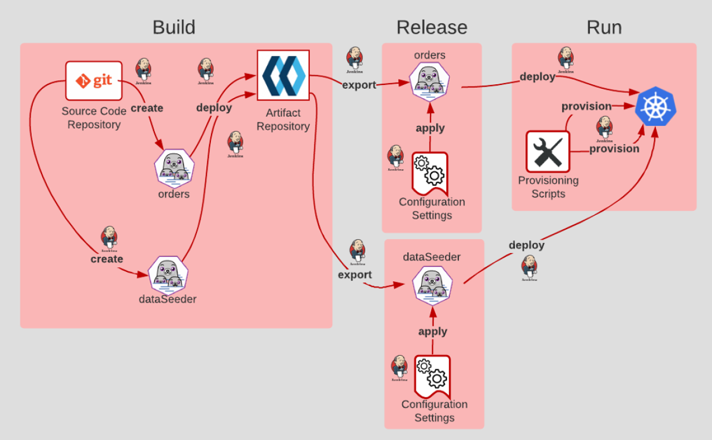

<p style="text-align: center;background-color: black;"></p3>
<h1 style="text-align: center;"><a href="https://12factor.net/">The Twelve Factor App</a></h1>

Who should read this document?
==============================

Any developer building applications which run as a service.  Ops engineers who deploy or manage such applications.

Introduction
============

In the modern era, software is commonly delivered as a service: called *web apps*, or *software-as-a-service*.  The twelve-factor app is a methodology for building software-as-a-service apps that:

* Use **declarative** formats for setup automation, to minimize time and cost for new developers joining the project;
* Have a **clean contract** with the underlying operating system, offering **maximum portability** between execution environments;
* Are suitable for **deployment** on modern **cloud platforms**, obviating the need for servers and systems administration;
* **Minimize divergence** between development and production, enabling **continuous deployment** for maximum agility;
* And can **scale up** without significant changes to tooling, architecture, or development practices.

The twelve-factor methodology can be applied to apps written in any programming language, and which use any combination of backing services (database, queue, memory cache, etc).

The Twelve Factors
==================

<table>
  <tr>
    <td>

[I. Codebase](#i-codebase)
One codebase tracked in revision control, many deploys

[II. Dependencies](#ii-dependencies)
Explicitly declare and isolate dependencies

[III. Config](#iii-config)
Store config in the environment

[IV. Backing services](#iv-backing-services)
Treat backing services as attached resources

[V. Build, release, run](#v-build-release-run)
Strictly separate build and run stages

[VI. Processes](#vi-processes)
Execute the app as one or more stateless processes

[VII. Port binding](#vii-port-binding)
Export services via port binding

[VIII. Concurrency](#viii-concurrency)
Scale out via the process model
    </td>
    <td>
[IX. Disposability](#ix-disposability)
Maximize robustness with fast startup and graceful shutdown

[X. Dev/prod parity](#x-dev-prod-parity)
Keep development, staging, and production as similar as possible

[XI. Logs](#xi-logs)
Treat logs as event streams

[XII. Admin processes](#xii-admin-processes)
Run admin/management tasks as one-off processes

[XIII. API first](#xiii-api-first)
Place emphasis on the importance of APIs within cloud-native application development

[XIV. Telemetry](#xiv-telemetry)
Collect data once the app is released into the wild

[XV. Authentication and authorization](#xv-authentication-and-authorization)
Security for cloud-native applications
    </td>
  </tr>
</table>

## I. Codebase
### One codebase tracked in revision control, many deploys

A twelve-factor app is always tracked in a version control system, such as [Git](http://git-scm.com/), [Mercurial](https://www.mercurial-scm.org/), or [Subversion](http://subversion.apache.org/).  A copy of the revision tracking database is known as a *code repository*, often shortened to *code repo* or just *repo*.

A *codebase* is any single repo (in a centralized revision control system like Subversion), or any set of repos who share a root commit (in a decentralized revision control system like Git).


There is always a one-to-one correlation between the codebase and the app:

* If there are multiple codebases, it's not an app -- it's a distributed system.  Each component in a distributed system is an app, and each can individually comply with twelve-factor.
* Multiple apps sharing the same code is a violation of twelve-factor.  The solution here is to factor shared code into libraries which can be included through the [dependency manager](#ii-dependencies).

There is only one codebase per app, but there will be many deploys of the app.  A *deploy* is a running instance of the app.  This is typically a production site, and one or more staging sites.  Additionally, every developer has a copy of the app running in their local development environment, each of which also qualifies as a deploy.

The codebase is the same across all deploys, although different versions may be active in each deploy.  For example, a developer has some commits not yet deployed to staging; staging has some commits not yet deployed to production.  But they all share the same codebase, thus making them identifiable as different deploys of the same app.

## II. Dependencies
### Explicitly declare and isolate dependencies

Most programming languages offer a packaging system for distributing support libraries, such as [CPAN](http://www.cpan.org/) for Perl or [Rubygems](http://rubygems.org/) for Ruby.  Libraries installed through a packaging system can be installed system-wide (known as "site packages") or scoped into the directory containing the app (known as "vendoring" or "bundling").


**A twelve-factor app never relies on implicit existence of system-wide packages.**  It declares all dependencies, completely and exactly, via a *dependency declaration* manifest.  Furthermore, it uses a *dependency isolation* tool during execution to ensure that no implicit dependencies "leak in" from the surrounding system.  The full and explicit dependency specification is applied uniformly to both production and development.

For example, [Bundler](https://bundler.io/) for Ruby offers the `Gemfile` manifest format for dependency declaration and `bundle exec` for dependency isolation.  In Python there are two separate tools for these steps -- [Pip](http://www.pip-installer.org/en/latest/) is used for declaration and [Virtualenv](http://www.virtualenv.org/en/latest/) for isolation.  Even C has [Autoconf](http://www.gnu.org/s/autoconf/) for dependency declaration, and static linking can provide dependency isolation.  No matter what the toolchain, dependency declaration and isolation must always be used together -- only one or the other is not sufficient to satisfy twelve-factor.

One benefit of explicit dependency declaration is that it simplifies setup for developers new to the app.  The new developer can check out the app's codebase onto their development machine, requiring only the language runtime and dependency manager installed as prerequisites.  They will be able to set up everything needed to run the app's code with a deterministic *build command*.  For example, the build command for Ruby/Bundler is `bundle install`, while for Clojure/[Leiningen](https://github.com/technomancy/leiningen#readme) it is `lein deps`.

Twelve-factor apps also do not rely on the implicit existence of any system tools.  Examples include shelling out to ImageMagick or `curl`.  While these tools may exist on many or even most systems, there is no guarantee that they will exist on all systems where the app may run in the future, or whether the version found on a future system will be compatible with the app.  If the app needs to shell out to a system tool, that tool should be vendored into the app.

Try these out:
- [Building a web application with Maven](https://openliberty.io/guides/maven-intro.html)
- [Building a web application with Gradle](https://openliberty.io/guides/gradle-intro.html)
- [Injecting dependencies into microservices](https://openliberty.io/guides/cdi-intro.html)

## III. Config
### Store config in the environment

An app's *config* is everything that is likely to vary between [deploys](#i-codebase) (staging, production, developer environments, etc).  This includes:

* Resource handles to the database, Memcached, and other [backing services](#iv-backing-services)
* Credentials to external services such as Amazon S3 or Twitter
* Per-deploy values such as the canonical hostname for the deploy


Apps sometimes store config as constants in the code.  This is a violation of twelve-factor, which requires **strict separation of config from code**.  Config varies substantially across deploys, code does not.

A litmus test for whether an app has all config correctly factored out of the code is whether the codebase could be made open source at any moment, without compromising any credentials.

Note that this definition of "config" does **not** include internal application config, such as `config/routes.rb` in Rails, or how [code modules are connected](http://docs.spring.io/spring/docs/current/spring-framework-reference/html/beans.html) in [Spring](http://spring.io/).  This type of config does not vary between deploys, and so is best done in the code.

Another approach to config is the use of config files which are not checked into revision control, such as `config/database.yml` in Rails.  This is a huge improvement over using constants which are checked into the code repo, but still has weaknesses: it's easy to mistakenly check in a config file to the repo; there is a tendency for config files to be scattered about in different places and different formats, making it hard to see and manage all the config in one place.  Further, these formats tend to be language- or framework-specific.

**The twelve-factor app stores config in *environment variables*** (often shortened to *env vars* or *env*).  Env vars are easy to change between deploys without changing any code; unlike config files, there is little chance of them being checked into the code repo accidentally; and unlike custom config files, or other config mechanisms such as Java System Properties, they are a language- and OS-agnostic standard.

Another aspect of config management is grouping.  Sometimes apps batch config into named groups (often called "environments") named after specific deploys, such as the `development`, `test`, and `production` environments in Rails.  This method does not scale cleanly: as more deploys of the app are created, new environment names are necessary, such as `staging` or `qa`.  As the project grows further, developers may add their own special environments like `joes-staging`, resulting in a combinatorial explosion of config which makes managing deploys of the app very brittle.

In a twelve-factor app, env vars are granular controls, each fully orthogonal to other env vars.  They are never grouped together as "environments", but instead are independently managed for each deploy.  This is a model that scales up smoothly as the app naturally expands into more deploys over its lifetime.

Try these out:

- [Configuring microservices](https://openliberty.io/guides/microprofile-config.html)
- [Separating configuration from code in microservices](https://openliberty.io/guides/microprofile-config-intro.html)
- [Configuring microservices running in Kubernetes](https://openliberty.io/guides/kubernetes-microprofile-config.html)

## IV. Backing services
### Treat backing services as attached resources

A *backing service* is any service the app consumes over the network as part of its normal operation.  Examples include datastores (such as [MySQL](http://dev.mysql.com/) or [CouchDB](http://couchdb.apache.org/)), messaging/queueing systems (such as [RabbitMQ](http://www.rabbitmq.com/) or [Beanstalkd](https://beanstalkd.github.io)), SMTP services for outbound email (such as [Postfix](http://www.postfix.org/)), and caching systems (such as [Memcached](http://memcached.org/)).


Backing services like the database are traditionally managed by the same systems administrators who deploy the app's runtime.  In addition to these locally-managed services, the app may also have services provided and managed by third parties.  Examples include SMTP services (such as [Postmark](http://postmarkapp.com/)), metrics-gathering services (such as [New Relic](http://newrelic.com/) or [Loggly](http://www.loggly.com/)), binary asset services (such as [Amazon S3](http://aws.amazon.com/s3/)), and even API-accessible consumer services (such as [Twitter](http://dev.twitter.com/), [Google Maps](https://developers.google.com/maps/), or [Last.fm](http://www.last.fm/api)).

**The code for a twelve-factor app makes no distinction between local and third party services.**  To the app, both are attached resources, accessed via a URL or other locator/credentials stored in the [config](#iii-config).  A [deploy](#i-codebase) of the twelve-factor app should be able to swap out a local MySQL database with one managed by a third party (such as [Amazon RDS](http://aws.amazon.com/rds/)) without any changes to the app's code.  Likewise, a local SMTP server could be swapped with a third-party SMTP service (such as Postmark) without code changes.  In both cases, only the resource handle in the config needs to change.

Each distinct backing service is a *resource*.  For example, a MySQL database is a resource; two MySQL databases (used for sharding at the application layer) qualify as two distinct resources.  The twelve-factor app treats these databases as *attached resources*, which indicates their loose coupling to the deploy they are attached to.


Resources can be attached to and detached from deploys at will.  For example, if the app's database is misbehaving due to a hardware issue, the app's administrator might spin up a new database server restored from a recent backup.  The current production database could be detached, and the new database attached -- all without any code changes.

Try these out:
- [Caching HTTP session data using JCache and Hazelcast](https://openliberty.io/guides/sessions.html)
- [Persisting data with MongoDB](https://openliberty.io/guides/mongodb-intro.html)
- [Accessing and persisting data in microservices using Java Persistence API (JPA)](https://openliberty.io/guides/jpa-intro.html)

## V. Build, release, run
### Strictly separate build and run stages

A [codebase](#i-codebase) is transformed into a (non-development) deploy through three stages:

* The *build stage* is a transform which converts a code repo into an executable bundle known as a *build*.  Using a version of the code at a commit specified by the deployment process, the build stage fetches vendors [dependencies](#ii-dependencies) and compiles binaries and assets.
* The *release stage* takes the build produced by the build stage and combines it with the deploy's current [config](#iii-config).  The resulting *release* contains both the build and the config and is ready for immediate execution in the execution environment.
* The *run stage* (also known as "runtime") runs the app in the execution environment, by launching some set of the app's [processes](#vi-processes) against a selected release.


**The twelve-factor app uses strict separation between the build, release, and run stages.**  For example, it is impossible to make changes to the code at runtime, since there is no way to propagate those changes back to the build stage.

Deployment tools typically offer release management tools, most notably the ability to roll back to a previous release.  For example, the [Capistrano](https://github.com/capistrano/capistrano/wiki) deployment tool stores releases in a subdirectory named `releases`, where the current release is a symlink to the current release directory.  Its `rollback` command makes it easy to quickly roll back to a previous release.

Every release should always have a unique release ID, such as a timestamp of the release (such as `2011-04-06-20:32:17`) or an incrementing number (such as `v100`).  Releases are an append-only ledger and a release cannot be mutated once it is created.  Any change must create a new release.

Builds are initiated by the app's developers whenever new code is deployed.  Runtime execution, by contrast, can happen automatically in cases such as a server reboot, or a crashed process being restarted by the process manager.  Therefore, the run stage should be kept to as few moving parts as possible, since problems that prevent an app from running can cause it to break in the middle of the night when no developers are on hand.  The build stage can be more complex, since errors are always in the foreground for a developer who is driving the deploy.

## VI. Processes
### Execute the app as one or more stateless processes

The app is executed in the execution environment as one or more *processes*.

In the simplest case, the code is a stand-alone script, the execution environment is a developer's local laptop with an installed language runtime, and the process is launched via the command line (for example, `python my_script.py`).  On the other end of the spectrum, a production deploy of a sophisticated app may use many [process types, instantiated into zero or more running processes](#viii-concurrency).


**Twelve-factor processes are stateless and [share-nothing](http://en.wikipedia.org/wiki/Shared_nothing_architecture).**  Any data that needs to persist must be stored in a stateful [backing service](#iv-backing-services), typically a database.

The memory space or filesystem of the process can be used as a brief, single-transaction cache.  For example, downloading a large file, operating on it, and storing the results of the operation in the database.  The twelve-factor app never assumes that anything cached in memory or on disk will be available on a future request or job -- with many processes of each type running, chances are high that a future request will be served by a different process.  Even when running only one process, a restart (triggered by code deploy, config change, or the execution environment relocating the process to a different physical location) will usually wipe out all local (e.g., memory and filesystem) state.

Asset packagers like [django-assetpackager](http://code.google.com/p/django-assetpackager/) use the filesystem as a cache for compiled assets.  A twelve-factor app prefers to do this compiling during the [build stage](/build-release-run). Asset packagers such as [Jammit](http://documentcloud.github.com/jammit/) and the [Rails asset pipeline](http://ryanbigg.com/guides/asset_pipeline.html) can be configured to package assets during the build stage.

Some web systems rely on ["sticky sessions"](http://en.wikipedia.org/wiki/Load_balancing_%28computing%29#Persistence) -- that is, caching user session data in memory of the app's process and expecting future requests from the same visitor to be routed to the same process.  Sticky sessions are a violation of twelve-factor and should never be used or relied upon.  Session state data is a good candidate for a datastore that offers time-expiration, such as [Memcached](http://memcached.org/) or [Redis](http://redis.io/).

## VII. Port binding
### Export services via port binding

Web apps are sometimes executed inside a webserver container.  For example, PHP apps might run as a module inside [Apache HTTPD](http://httpd.apache.org/), or Java apps might run inside [Tomcat](http://tomcat.apache.org/).


**The twelve-factor app is completely self-contained** and does not rely on runtime injection of a webserver into the execution environment to create a web-facing service.  The web app **exports HTTP as a service by binding to a port**, and listening to requests coming in on that port.

In a local development environment, the developer visits a service URL like `http://localhost:5000/` to access the service exported by their app.  In deployment, a routing layer handles routing requests from a public-facing hostname to the port-bound web processes.

This is typically implemented by using [dependency declaration](#ii-dependencies) to add a webserver library to the app, such as [Tornado](http://www.tornadoweb.org/) for Python, [Thin](http://code.macournoyer.com/thin/) for Ruby, or [Jetty](http://www.eclipse.org/jetty/) for Java and other JVM-based languages.  This happens entirely in *user space*, that is, within the app's code.  The contract with the execution environment is binding to a port to serve requests.

HTTP is not the only service that can be exported by port binding.  Nearly any kind of server software can be run via a process binding to a port and awaiting incoming requests.  Examples include [ejabberd](http://www.ejabberd.im/) (speaking [XMPP](http://xmpp.org/)), and [Redis](http://redis.io/) (speaking the [Redis protocol](http://redis.io/topics/protocol)).

Note also that the port-binding approach means that one app can become the [backing service](#iv-backing-services) for another app, by providing the URL to the backing app as a resource handle in the [config](#iii-config) for the consuming app.

The essential idea behind the principle of port binding is that the uniform use of a port number is the best way to expose a process to the network. For example, the patterns have emerged in which port 80 is conventional for web servers running under HTTP, port 443 is the default port number for HTTPS, port 22 is for SSH, port 3306 is the default port for MySQL, and port 27017 is the default port for MongoDB.

## VIII. Concurrency
### Scale out via the process model

Any computer program, once run, is represented by one or more processes.  Web apps have taken a variety of process-execution forms.  For example, PHP processes run as child processes of Apache, started on demand as needed by request volume.  Java processes take the opposite approach, with the JVM providing one massive uberprocess that reserves a large block of system resources (CPU and memory) on startup, with concurrency managed internally via threads.  In both cases, the running process(es) are only minimally visible to the developers of the app.


**In the twelve-factor app, processes are a first class citizen.**  Processes in the twelve-factor app take strong cues from [the unix process model for running service daemons](https://adam.herokuapp.com/past/2011/5/9/applying_the_unix_process_model_to_web_apps/).  Using this model, the developer can architect their app to handle diverse workloads by assigning each type of work to a *process type*.  For example, HTTP requests may be handled by a web process, and long-running background tasks handled by a worker process.

This does not exclude individual processes from handling their own internal multiplexing, via threads inside the runtime VM, or the async/evented model found in tools such as [EventMachine](https://github.com/eventmachine/eventmachine), [Twisted](http://twistedmatrix.com/trac/), or [Node.js](http://nodejs.org/).  But an individual VM can only grow so large (vertical scale), so the application must also be able to span multiple processes running on multiple physical machines.

The process model truly shines when it comes time to scale out.  The [share-nothing, horizontally partitionable nature of twelve-factor app processes](#vi-processes) means that adding more concurrency is a simple and reliable operation.  The array of process types and number of processes of each type is known as the *process formation*.

Twelve-factor app processes [should never daemonize](http://dustin.github.com/2010/02/28/running-processes.html) or write PID files.  Instead, rely on the operating system's process manager (such as [systemd](https://www.freedesktop.org/wiki/Software/systemd/), a distributed process manager on a cloud platform, or a tool like [Foreman](http://blog.daviddollar.org/2011/05/06/introducing-foreman.html) in development) to manage [output streams](#xi-logs), respond to crashed processes, and handle user-initiated restarts and shutdowns.

## IX. Disposability
### Maximize robustness with fast startup and graceful shutdown

**The twelve-factor app's [processes](#vi-processes) are *disposable*, meaning they can be started or stopped at a moment's notice.**  This facilitates fast elastic scaling, rapid deployment of [code](#i-codebase) or [config](#iii-config) changes, and robustness of production deploys.

```JavaScript
const shutdown = async (signal) => {
   logger.info(`Disconnecting message broker at ${new Date()}`);
   messageBroker.disconnect();

   logger.info(`Disconnecting database at ${new Date()}`);
   database.disconnect();

   let shutdownMessage;

   if (!signal) {
       shutdownMessage = (`MyCool service shutting down at ${new Date()}`);
   } else {
       shutdownMessage = (`Signal ${signal} : MyCool service shutting down at ${new Date()}`);
   }
   const obj = {status: "SHUTDOWN", shutdownMessage, pid: process.pid};
   await server.close(() => {
       console.log(obj);
       process.exit(0);
   });
};
```

Processes should strive to **minimize startup time**.  Ideally, a process takes a few seconds from the time the launch command is executed until the process is up and ready to receive requests or jobs.  Short startup time provides more agility for the [release](#v-build-release-run) process and scaling up; and it aids robustness, because the process manager can more easily move processes to new physical machines when warranted.

Processes **shut down gracefully when they receive a [SIGTERM](http://en.wikipedia.org/wiki/SIGTERM)** signal from the process manager.  For a web process, graceful shutdown is achieved by ceasing to listen on the service port (thereby refusing any new requests), allowing any current requests to finish, and then exiting.  Implicit in this model is that HTTP requests are short (no more than a few seconds), or in the case of long polling, the client should seamlessly attempt to reconnect when the connection is lost.

For a worker process, graceful shutdown is achieved by returning the current job to the work queue.  For example, on [RabbitMQ](http://www.rabbitmq.com/) the worker can send a [`NACK`](http://www.rabbitmq.com/amqp-0-9-1-quickref.html#basic.nack); on [Beanstalkd](https://beanstalkd.github.io), the job is returned to the queue automatically whenever a worker disconnects.  Lock-based systems such as [Delayed Job](https://github.com/collectiveidea/delayed_job#readme) need to be sure to release their lock on the job record.  Implicit in this model is that all jobs are [reentrant](http://en.wikipedia.org/wiki/Reentrant_%28subroutine%29), which typically is achieved by wrapping the results in a transaction, or making the operation [idempotent](http://en.wikipedia.org/wiki/Idempotence).

Processes should also be **robust against sudden death**, in the case of a failure in the underlying hardware.  While this is a much less common occurrence than a graceful shutdown with `SIGTERM`, it can still happen.  A recommended approach is use of a robust queueing backend, such as Beanstalkd, that returns jobs to the queue when clients disconnect or time out.  Either way, a twelve-factor app is architected to handle unexpected, non-graceful terminations.  [Crash-only design](http://lwn.net/Articles/191059/) takes this concept to its [logical conclusion](http://docs.couchdb.org/en/latest/intro/overview.html).

## X. Dev/prod parity
### Keep development, staging, and production as similar as possible


Historically, there have been substantial gaps between development (a developer making live edits to a local [deploy](#i-codebase) of the app) and production (a running deploy of the app accessed by end users).  These gaps manifest in three areas:

* **The time gap**: A developer may work on code that takes days, weeks, or even months to go into production.
* **The personnel gap**: Developers write code, ops engineers deploy it.
* **The tools gap**: Developers may be using a stack like Nginx, SQLite, and OS X, while the production deploy uses Apache, MySQL, and Linux.

**The twelve-factor app is designed for [continuous deployment](http://avc.com/2011/02/continuous-deployment/) by keeping the gap between development and production small.**  Looking at the three gaps described above:

* Make the time gap small: a developer may write code and have it deployed hours or even just minutes later.
* Make the personnel gap small: developers who wrote code are closely involved in deploying it and watching its behavior in production.
* Make the tools gap small: keep development and production as similar as possible.

Summarizing the above into a table:

<table>
  <tr>
    <th></th>
    <th>Traditional app</th>
    <th>Twelve-factor app</th>
  </tr>
  <tr>
    <th>Time between deploys</th>
    <td>Weeks</td>
    <td>Hours</td>
  </tr>
  <tr>
    <th>Code authors vs code deployers</th>
    <td>Different people</td>
    <td>Same people</td>
  </tr>
  <tr>
    <th>Dev vs production environments</th>
    <td>Divergent</td>
    <td>As similar as possible</td>
  </tr>
</table>

[Backing services](#iv-backing-services), such as the app's database, queueing system, or cache, is one area where dev/prod parity is important.  Many languages offer libraries which simplify access to the backing service, including *adapters* to different types of services.  Some examples are in the table below.

<table>
  <tr>
    <th>Type</th>
    <th>Language</th>
    <th>Library</th>
    <th>Adapters</th>
  </tr>
  <tr>
    <td>Database</td>
    <td>Ruby/Rails</td>
    <td>ActiveRecord</td>
    <td>MySQL, PostgreSQL, SQLite</td>
  </tr>
  <tr>
    <td>Queue</td>
    <td>Python/Django</td>
    <td>Celery</td>
    <td>RabbitMQ, Beanstalkd, Redis</td>
  </tr>
  <tr>
    <td>Cache</td>
    <td>Ruby/Rails</td>
    <td>ActiveSupport::Cache</td>
    <td>Memory, filesystem, Memcached</td>
  </tr>
</table>

Developers sometimes find great appeal in using a lightweight backing service in their local environments, while a more serious and robust backing service will be used in production.  For example, using SQLite locally and PostgreSQL in production; or local process memory for caching in development and Memcached in production.

**The twelve-factor developer resists the urge to use different backing services between development and production**, even when adapters theoretically abstract away any differences in backing services.  Differences between backing services mean that tiny incompatibilities crop up, causing code that worked and passed tests in development or staging to fail in production.  These types of errors create friction that disincentivizes continuous deployment.  The cost of this friction and the subsequent dampening of continuous deployment is extremely high when considered in aggregate over the lifetime of an application.

Lightweight local services are less compelling than they once were.  Modern backing services such as Memcached, PostgreSQL, and RabbitMQ are not difficult to install and run thanks to modern packaging systems, such as [Homebrew](http://mxcl.github.com/homebrew/) and [apt-get](https://help.ubuntu.com/community/AptGet/Howto).  Alternatively, declarative provisioning tools such as [Chef](http://www.opscode.com/chef/) and [Puppet](http://docs.puppetlabs.com/) combined with light-weight virtual environments such as [Docker](https://www.docker.com/) and [Vagrant](http://vagrantup.com/) allow developers to run local environments which closely approximate production environments. The cost of installing and using these systems is low compared to the benefit of dev/prod parity and continuous deployment.

Adapters to different backing services are still useful, because they make porting to new backing services relatively painless.  But all deploys of the app (developer environments, staging, production) should be using the same type and version of each of the backing services.

## XI. Logs
### Treat logs as event streams

*Logs* provide visibility into the behavior of a running app.  In server-based environments they are commonly written to a file on disk (a "logfile"); but this is only an output format.


Logs are the [stream](https://adam.herokuapp.com/past/2011/4/1/logs_are_streams_not_files/) of aggregated, time-ordered events collected from the output streams of all running processes and backing services.  Logs in their raw form are typically a text format with one event per line (though backtraces from exceptions may span multiple lines).  Logs have no fixed beginning or end, but flow continuously as long as the app is operating.

**A twelve-factor app never concerns itself with routing or storage of its output stream.**  It should not attempt to write to or manage logfiles.  Instead, each running process writes its event stream, unbuffered, to `stdout`.  During local development, the developer will view this stream in the foreground of their terminal to observe the app's behavior.

In staging or production deploys, each process' stream will be captured by the execution environment, collated together with all other streams from the app, and routed to one or more final destinations for viewing and long-term archival.  These archival destinations are not visible to or configurable by the app, and instead are completely managed by the execution environment.  Open-source log routers (such as [Logplex](https://github.com/heroku/logplex) and [Fluentd](https://github.com/fluent/fluentd)) are available for this purpose.

The event stream for an app can be routed to a file, or watched via realtime tail in a terminal.  Most significantly, the stream can be sent to a log indexing and analysis system such as [Splunk](http://www.splunk.com/), or a general-purpose data warehousing system such as [Hadoop/Hive](http://hive.apache.org/).  These systems allow for great power and flexibility for introspecting an app's behavior over time, including:

* Finding specific events in the past.
* Large-scale graphing of trends (such as requests per minute).
* Active alerting according to user-defined heuristics (such as an alert when the quantity of errors per minute exceeds a certain threshold).

## XII. Admin processes
### Run admin/management tasks as one-off processes

The [process formation](#viii-concurrency) is the array of processes that are used to do the app's regular business (such as handling web requests) as it runs.  Separately, developers will often wish to do one-off administrative or maintenance tasks for the app, such as:

* Running database migrations (e.g. `manage.py migrate` in Django, `rake db:migrate` in Rails).
* Running a console (also known as a [REPL](http://en.wikipedia.org/wiki/Read-eval-print_loop) shell) to run arbitrary code or inspect the app's models against the live database.  Most languages provide a REPL by running the interpreter without any arguments (e.g. `python` or `perl`) or in some cases have a separate command (e.g. `irb` for Ruby, `rails console` for Rails).
* Running one-time scripts committed into the app's repo (e.g. `php scripts/fix_bad_records.php`).


The illustration above shows a service named `orders` that is deployed as a Docker container. Also, there is an admin service name `dataSeeder`, which can seed data into the `orders` service. The service, `dataSeeder`, is an admin process that is intended to be used with Orders, as shown in the diagram below.

However, even though `dataSeeder` is an admin process, it is given a Build, Release, and Run deployment path similar to the Orders service. Also, it is released according to the principles of Codebase and Dev/Prod Parity. The admin process, `dataSeeder`, is not separate from the overall SDLC, but rather part of it.

One-off admin processes should be run in an identical environment as the regular [long-running processes](#vi-processes) of the app.  They run against a [release](#v-build-release-run), using the same [codebase](#i-codebase) and [config](#iii-config) as any process run against that release.  Admin code must ship with application code to avoid synchronization issues.

The same [dependency isolation](#ii-dependencies) techniques should be used on all process types.  For example, if the Ruby web process uses the command `bundle exec thin start`, then a database migration should use `bundle exec rake db:migrate`.  Likewise, a Python program using Virtualenv should use the vendored `bin/python` for running both the Tornado webserver and any `manage.py` admin processes.

Twelve-factor strongly favors languages which provide a REPL shell out of the box, and which make it easy to run one-off scripts.  In a local deploy, developers invoke one-off admin processes by a direct shell command inside the app's checkout directory.  In a production deploy, developers can use ssh or other remote command execution mechanism provided by that deploy's execution environment to run such a process.

## XIII. API first
### Place emphasis on the importance of APIs within cloud-native application development

API first was introduced as a factor to place emphasis on the importance of APIs within cloud-native application development. Applications that are developed for the cloud are usually a participant in an ecosystem of distributed services and if APIs are not clearly defined, this can lead to a nightmare of integration failures. Hence, the importance of this factor in designing applications that thrive in the cloud.


**Note**: Some of the factors in these methodologies do not necessarily map to specific physical requirements imposed by the cloud but instead relate more to the habits of people and organizations when building cloud-native apps.

When developing an enterprise application for the cloud, the application often becomes a participant in an ecosystem of services. But if APIs are not clearly defined within an application, this can lead to integration failures within this ecosystem. This is precisely what this factor is designed to help mitigate.

The addition of this factor helps to formally recognize APIs as a first-class artifact of the development process. An API-first approach involves developing APIs that are consistent and reusable, giving teams the ability to work against each other’s public contracts without interfering with the internal development processes. By utilizing an API-first approach and clearly planning the various APIs that will be consumed by client applications and services, each API can be very clearly designed to be as effective as possible and can be easily mocked up. This enables greater collaboration with stakeholders and enables developers and architects to test or vet their direction/plans before investing too much into supporting a given API. The clear design process for each API also enables more effective documentation to be created for each. Providing documentation that is well-designed, comprehensive, and easy to follow is crucial when it comes to ensuring developers have a great experience with the API.

An API description language can be helpful in establishing a contract for how the API is supposed to behave. API description languages are domain-specific languages, which are suited for describing APIs. They are intuitive languages that can be easily written, read and understood by API developers, API designers, and API architects. Compared to programming languages or API implementation languages, API description languages use a higher level of abstraction and a declarative paradigm, which means that they can be used to help express the what rather than the how – they can help define the data structure of the possible responses (the what), instead of describing how the response is computed. During the initial design phases of an API, this can be especially helpful for mocking up an API and gathering feedback from stakeholders. Examples of API description languages include OpenAPI, Swagger, and RAML.

To clearly define an API in the source code of an application, standard models from API specifications can be used. An API specification can provide a broad understanding of how an API behaves and how a particular API links with other APIs. It explains how the API functions and the results to expect when using it. One example of an API specification is the OpenAPI Specification. The [OpenAPI v3 specification](https://github.com/OAI/OpenAPI-Specification/blob/master/versions/3.0.0.md) defines a standard language-agnostic interface for describing REST APIs, which allows documentation to be generated from the APIs themselves. The MicroProfile specification builds upon this standard with its OpenAPI 1.0 component, which provides a set of Java interfaces and programming models that allow Java developers to natively produce OpenAPI v3 documents from their JAX-RS applications.

If you’re interested in learning more about how you could make use of MicroProfile OpenAPI within your own application, check out our Open Liberty blog post [Introducing MicroProfile OpenAPI 1.0](https://openliberty.io/blog/2018/05/22/microprofile-openapi-intro.html).

## XIV. Telemetry
### Collect data once the app is released into the wild

Telemetry is another important addition. You may question why telemetry is needed as its own factor in addition to the logging factor, which was already included in the original 12-factor app methodology. Although logging is an important element to building cloud-native applications, it is generally a tool used during development to diagnose errors and code flows. Logging is typically oriented around the internal structure of your app, rather than reflecting real-world customer usage. Telemetry, on the other hand, is focused on data collection once the app is released into the wild. Telemetry and real-time app monitoring enable developers to monitor their application’s performance, health, and key metrics in this complicated and highly distributed environment.


The use of telemetry should be an essential part of any cloud-native application. Previously building applications locally enabled developers to inspect the inside of an application, execute a debugger, and perform hundreds of other tasks that give visibility deep within an app and its behavior relatively easily. However, applications running in the cloud do not have this kind of direct access, and your app instance might move anywhere across the world with little or no warning. In addition to this, you may start with only one instance of your app, and a few minutes later, you might have hundreds of copies of your application running. These are all incredibly powerful, useful features, but they present an unfamiliar pattern for real-time application monitoring and telemetry.

Telemetry can include domain-specific metrics (those needed or required by your specific organization, department, or team), as well as health and system metrics for your application. Health and system metrics include application start, shutdown, scaling, web request tracing, and the results of periodic health checks. MicroProfile Health and MicroProfile Metrics are fantastic open cloud-native Java tools that can be utilized to collect these sorts of metrics.

If you’re interested in trying out MicroProfile Health or MicroProfile Metrics then try out our developer guides:

- [Adding health reports to microservices](https://openliberty.io/guides/microprofile-health.html)
- [Providing metrics from a microservice](https://openliberty.io/guides/microprofile-metrics.html)

The [Open Liberty Operator](https://operatorhub.io/operator/open-liberty) can also be used to help improve telemetry for Kubernetes deployments.

To find out more about how you could make us of and integrate these telemetry tools into your own applications, have a look at the following Open Liberty content:

- [Metrics and Monitoring Guidance for Open Liberty and WebSphere Application Server Traditional](https://community.ibm.com/community/user/wasdevops/blogs/don-bourne1/2021/06/26/metrics-and-monitoring-guidance-for-open-liberty-a)
- [Open Liberty Grafana Dashboard](https://grafana.com/grafana/dashboards/11706)
- [New Kibana dashboard visualizations to spot potential problems in your Liberty servers](https://openliberty.io/blog/2020/01/23/Kibana-dashboard-visualizations.html)

## XV. Authentication and authorization
### Security for cloud-native applications

The addition of the Authentication and authorization factor adds in an important emphasis on security for cloud-native applications. Deploying applications in a cloud environment means that applications can be transported across many data centers worldwide, executed within multiple containers, and accessed by an almost unlimited number of clients. So, it’s vital that security is not an afterthought for cloud-native applications and is a very important factor to consider.


Security is a vital part of any application and cloud environment. Regardless of whether that app is destined for an enterprise, a mobile device, or the cloud, security should never be an afterthought. Cloud-native applications can secure their endpoints with role-based access control (RBAC). These roles dictate whether the calling client has sufficient permission for the application to honor the request and helps track who is making the request for audit purposes.

MicroProfile JWT (JSON Web Token), a token-based authentication mechanism to authenticate, authorize, and verify users, can be a useful open source Java API to enable this factor. A JSON Web Token (JWT) is a self-contained token designed to securely transmit information as a JSON object. The information in this JSON object is digitally signed and can be trusted and verified by the recipient. For microservices, a token-based authentication mechanism offers a lightweight way for security controls and security tokens to propagate user identities across different services. JWT is becoming the most common token format because it follows well-defined and known standards. MicroProfile JWT standards define the required format of JWT for authentication and authorization. The standards also map JWT claims to various Jakarta EE container APIs and make the set of claims available through getter methods.

To find out more and get hands-on with this technology, have a look at the following Open Liberty content:

- [Securing microservices with JSON Web Tokens](https://openliberty.io/guides/microprofile-jwt.html)
- [Single sign-on (SSO)](https://openliberty.io/docs/20.0.0.12/single-sign-on.html)
- [Authorization](https://openliberty.io/docs/20.0.0.12/authorization.html)
- [Authenticating users through social media providers](https://openliberty.io/guides/social-media-login.html)

In addition to this, there are also cloud-specific authentication tools that can be used, such as Azure Active Directory. See our Open Liberty blog post, [Securing Open Liberty applications with Azure Active Directory using OpenID Connect](https://openliberty.io/blog/2020/09/04/securing-open-liberty-azure.html) to find out how you can use this with your Open Liberty applications.