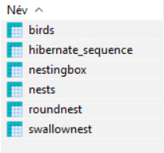
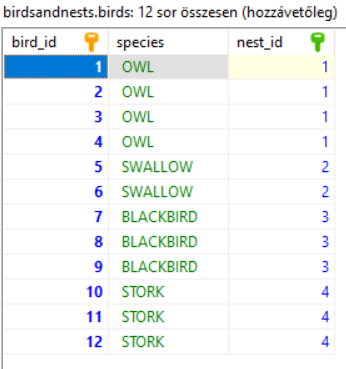
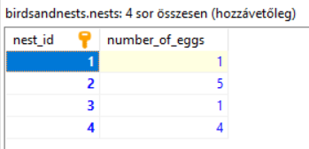
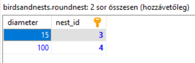
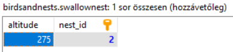
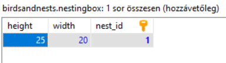

# Fészekrakás

A feladat egy olyan alkalmazás megvalósítása, mely madarakat és madárfészkeket tart 
nyilván adatbázisban. Az alkalmazás az adatbázis műveletek megvalósításához JPA technológiát 
használ. Az adatbázis kapcsolatok beállítását végezd el megfelelően! A táblák kezelését bízd 
a JPA implementációra!

## Az alkalmazás

Az adatbázisban az alábbi táblák jönnek létre (ezek részletesebben is megtalálhatóak itt lejjebb 
a szövegben):

A `Bird` entitás az adatbázisban a következő táblába képeződik le:

A `Nest` entitás táblája pedig így néz ki:

Hozd létre ezt a két entitás osztályt olyan módon, hogy a forráskódban az attribútumok 
elnevezése a Java nyelvben szokásos konvencióknak feleljen meg, de az adatbázisban 
a táblák és az oszlopok elnevezése és tartalma a képeken látható módon jelenjen meg! 
A két entitás egymással kétirányú egy-több kapcsolatban áll (egy fészekhez több madár 
is kapcsolódik), állítsd be ezt a kapcsolatot megfelelően!

A `Nest` entitásnak három leszármazottja van, melyeknek újabb attribútumokban vannak eltárolva 
bizonyos méreteik.

A `RoundNest` a következő táblába képeződik le:

A `SwallowNest` ebbe:

A `NestingBox` pedig az alábbiba:

Hozd létre a leszármazott osztályokat és állítsd be a `Nest` entitáson a megfelelő 
annotáció használatával, hogy ezek a képeken látható módon kerüljenek be az adatbázisba!

Ezután hozd létre az adatbázis műveletek elvégzéséhez szükséges osztályokat a 
következő metódusokkal:

A `BirdDao` osztályban az alábbiak találhatók:

* `void saveBird(Bird bird)` - elment egy madarat az adatbázisba.
* `List<Bird> listBirds()` - kilistázza az adatbázisból az összes madarat 
* `List<Bird> listBirdsSpeciesGiven(BirdSpecies species)` - kilistázza az adatbázisból a 
  paraméterként megadott fajtájú madarakat. 
* `List<Bird> listBirdsWithEggsGiven(int eggs)` - kilistázza az adatbázisból azokat a madarakat, 
  melyeknek fészkében a paraméterként megadott számú tojás található.
* `void deleteBird(long id)` - töröl egy madarat az adatbázisból.  
  
A `NestDao` osztályban az alábbiak találhatók:

* `void saveNest(Nest nest)` - elment egy fészket az adatbázisba.
* `Nest findNestById(long id)` - az egyedi azonosítója alapján megkeres egy fészket az adatbázisban.
* `Nest findNestWithMinBirds()` - megkeresi azt a fészket az adatbázisban, amelyben a 
  legkevesebb madár található. Figyelj arra, hogy a visszakapott találatban lekérhető legyen a 
  fészekhez tartozó madarak listája is!
* `long countNestsWithEggsGiven(int eggs)` - visszaadja azon fészkek számát, melyben a 
  paraméterként megadott számú tojás található.
  
Hozz létre ezenkívül egy `BirdService` osztályt, amely a konstruktorában egy `BirdDao` 
példányt vár paraméterül! Az osztálynak legyen egy `Map<BirdSpecies, Integer> getBirdStatistics()` 
metódusa, mely egy adatszerkezetben visszaadja, hogy az egyes fajtájú madarakból hány található 
az adatbázisban!

## Az alkalmazás tesztelése

Az alkalmazás tesztelésére hozz létre három tesztosztályt!

A `BirdDaoTest` négy tesztmetódust tartalmazzon:

* egyet, amelyben az egyszerű mentés utáni listázást teszteled. Itt AssertJ segítségével írd meg az assertet!
* egyet a `listBirdsSpeciesGiven(BirdSpecies species)` metódus működésének tesztelésére.
* legyen egy ismétléses teszteset (`@RepeatedTest`) a `listBirdsWithEggsGiven(int eggs)` metódus 
  tesztelésére, ahol a teszteset különböző értékekkel hívja meg ezt a metódust!
* végül legyen egy teszteset, melyben egy adatbázisbeli rekord törlését teszteled!  
  
A `NestDaoTest` három tesztmetódust tartalmazzon:

* egyet, amelyben az egyszerű mentés után az egyedi azonosító alapján való visszakérést teszteled.
* egyet a `findNestWithMinBirds()` metódus működésének tesztelésére. Itt a visszakapott fészek madarait 
  tartalmazó listára írj AssertJ segítségével assertet!
* végül legyen egy paraméterezett teszteset, amely egy másik metódusban definiált különböző értékekkel 
  hívja meg a `countNestsWithEggsGiven(int eggs)` metódust!
  
A két tesztosztály tesztadatainak az előkészítését egy-egy külön metódusban végezd! Egyedileg is megoldhatod 
ezt, vagy a fentebb mellékelt adatbázis táblákban találsz erre egy lehetséges példát.

A `BirdServiceTest` osztályban a `BirdService` függőségét a tesztosztály mockolja! Írj egy tesztmetódust a
`getBirdStatistics()` tesztelésére, melyben megadod, hogy a mockolt objektumot használó metódus 
milyen értékkel térjen vissza, erre írj egy assertet, valamint ellenőrizz rá arra is, hogy ténylegesen 
meghívásra került-e a szükséges adatbáziskezelő metódus!

A tesztosztályok és tesztmetódusok elnevezéseit a megfelelő annotációk segítségével add meg, 
hogy jól olvasható formában kerüljenek kiírásra!
